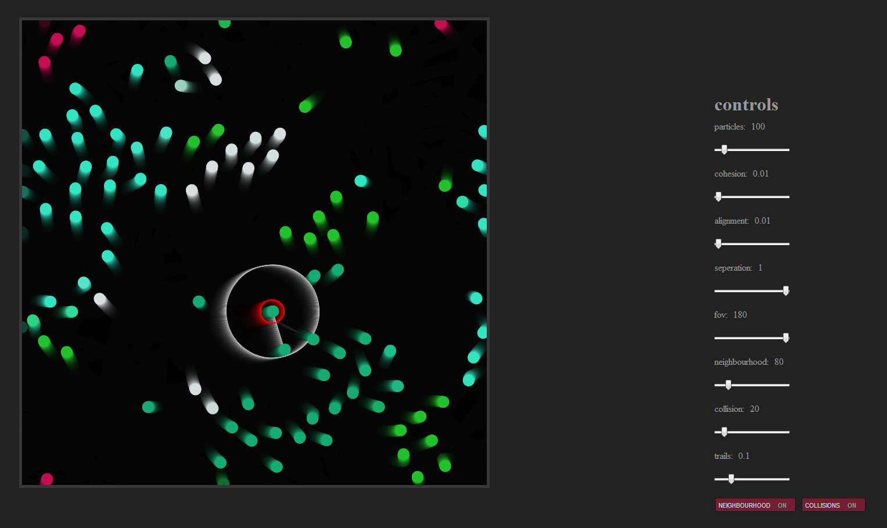
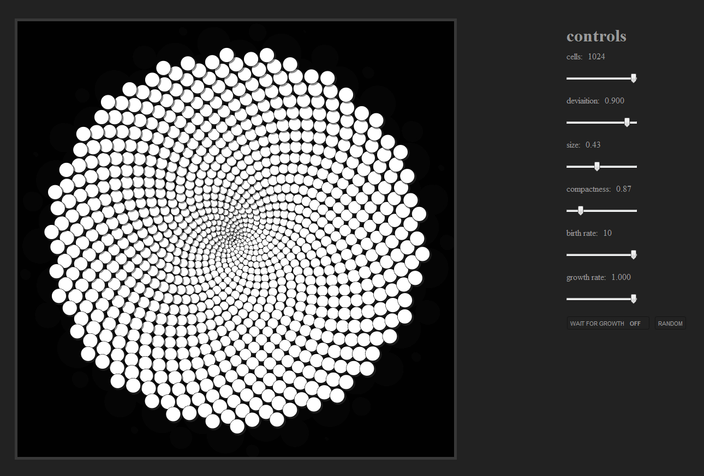

HTML5
=====

Just a bit of fun, with some HTML5 canvas experiments

Particle Systems - Boids
--------------
[Demo] (http://www.avondo.com/html5/Particle%20Systems%20-%20Boids/test.html)

Reaction Diffusion - Gray-Scott Model
--------------
[Demo](http://www.avondo.com/html5/Reaction%20Diffusion%20-%20Gray-Scott%20Model/test.html)

Phyllotaxy - Spirals
--------------
[Demo](http://www.avondo.com/html5/Phyllotaxy%20-%20Spirals/test.html)

