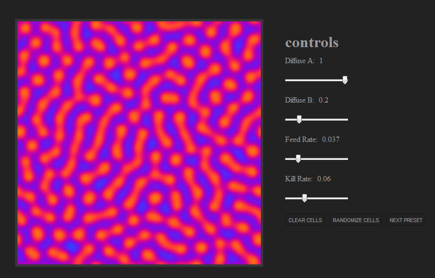

HTML5
=====

Just a bit of fun, with some HTML5 canvas experiments

Particle Systems - Boids
--------------

Reaction Diffusion - Gray-Scott Model
--------------

Phyllotaxy - Spirals
--------------

